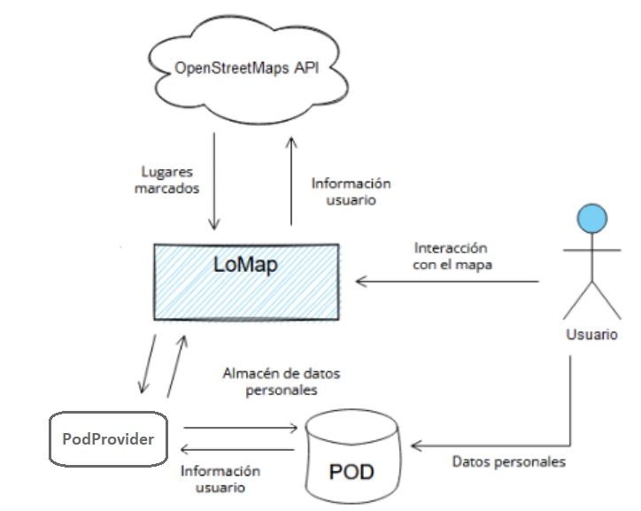
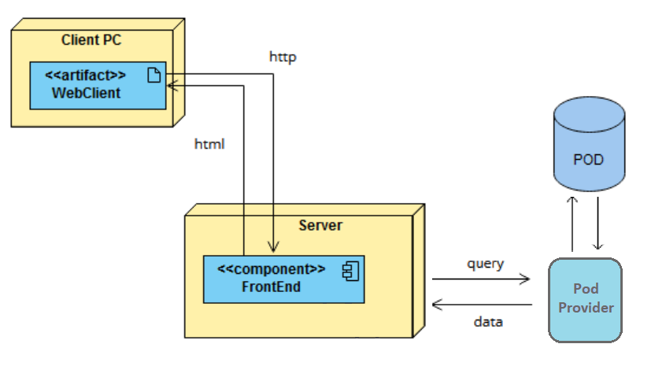

[[section-system-scope-and-context]]
== System Scope and Context

=== Business Context

Usuario: cliente principal de LoMap, interactúa con la aplicación y posee un POD. 

POD: almacén de los datos personales de un único usuario, de manera que aumenta el nivel de privacidad y descentralización. 

BD: infraestructura persistente que almacena los lugares reconocidos por los usuarios. 

OpenStreetMaps API: API del servicio externo de mapas utilizado para la localización geográfica de los lugares de interés. 

=== Technical Context

WebClient: aplicación ejecutada en el lado del cliente, realiza peticiones y recibe respuestas html. 

FrontEnd: front end que comparte red con el cliente, recibe peticiones y devuelve respuestas en html. Intermediario entre la lógica y el cliente. 

BackEnd: implementación de la lógica, así como de las conexiones a los almacenes persistentes, recibe peticiones del frontend y devuelve datos en JSON. También lanza querys a la BD y los pods para obtener datos persistentes o guardarlos. 

BD: base de datos del servidor 

POD: almacenamiento individual del usuario, personal y descentralizado. 

